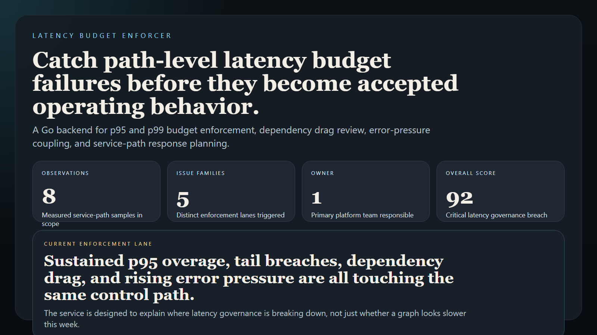
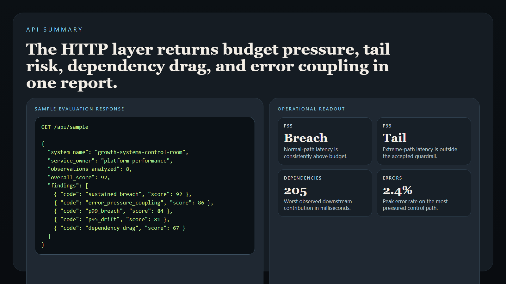
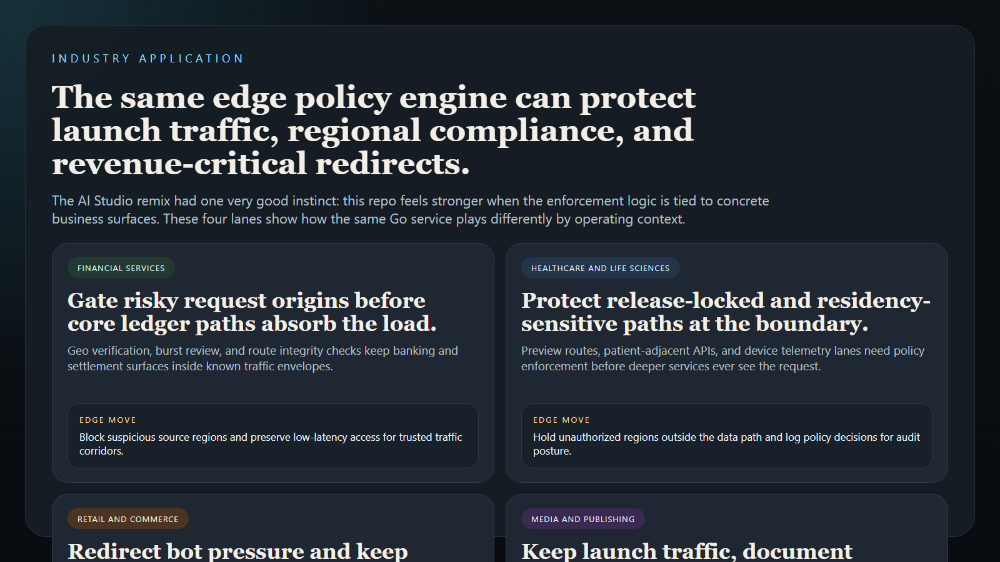
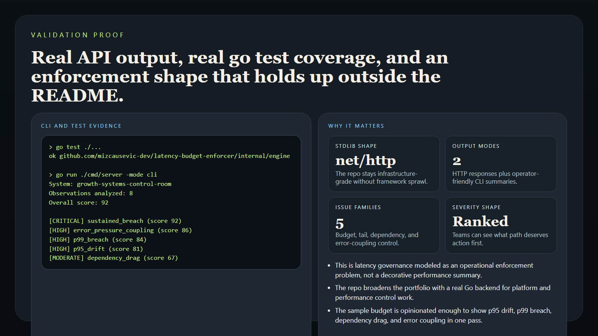

# Latency Budget Enforcer

> **Go platform engineering portfolio project** for latency budget enforcement, service-path breach scoring, and operator-facing response planning.

**Portfolio takeaway:** *"Latency budgets only matter when they are translated into ranked breaches, ownership lanes, and concrete next actions."*

---

## Project Overview

| Attribute | Detail |
|---|---|
| **Language** | Go |
| **Runtime Shape** | HTTP API + CLI |
| **Domain** | Latency budget enforcement and service-path response |
| **Enforcement Families** | sustained breach · p95 drift · p99 breach · dependency drag · error-pressure coupling |
| **Output Modes** | JSON API · terminal summary |
| **Primary Users** | platform engineering · SRE · performance teams |

---

## Executive Summary

Latency Budget Enforcer models the kind of service teams use when latency policy needs to become operationally actionable instead of living as a passive SLO document. The service ingests latency budgets and measured service-path observations, compares them against p95 and p99 expectations, scores the severity of the breaches, and returns evidence-backed findings with next actions.

The repo is intentionally built as a Go backend rather than another dashboard. It demonstrates how latency governance can be treated as an operating control: measure the path, rank the overages, isolate dependency drag, and route the action before user-facing systems, AI pipelines, or revenue surfaces start absorbing avoidable performance loss.

---

## Enforcement Flow

```text
latency budgets + service-path observations
                   |
                   v
typed evaluation request
                   |
                   +--> sustained breach checks
                   +--> p95 drift checks
                   +--> p99 breach checks
                   +--> dependency drag checks
                   +--> error-pressure coupling checks
                   |
                   v
severity-scored latency report
```

---

## Enforcement Families

### Sustained Breach

- repeated path latency above the agreed budget
- service posture that is no longer momentary noise

### P95 Drift

- normal-path latency inflation
- experience degradation under typical traffic

### P99 Breach

- tail-latency spikes strong enough to shape incidents
- extreme-path behavior that breaks user trust

### Dependency Drag

- downstream service contribution to the overage
- infrastructure or integration layers stretching the path

### Error-Pressure Coupling

- latency and elevated error rate happening together
- breach posture with user-visible failure risk

---

## Usage

### Run the API

```bash
go run ./cmd/server
```

### Open the Docs Route

```text
http://127.0.0.1:8080/
```

### Evaluate the Sample Budget

```bash
go run ./cmd/server -mode cli
```

### Run the Tests

```bash
go test ./...
```

---

## Sample Output

```text
Latency Budget Enforcer
=======================
System: growth-systems-control-room
Observations analyzed: 8
Overall score: 92

[CRITICAL] sustained_breach (score 92)
Summary: The primary service path is breaching its latency budget often enough to require coordinated action.
```

---

## Screenshots

### Hero Capture



### API Summary



### Industry Application



### Validation Proof



---

## Industry Applications

### Revenue Systems

- catch path-level latency inflation before checkout, pricing, or booking flows lose trust
- isolate dependency drag before revenue teams feel the effect downstream

### AI Operations

- enforce latency posture on model-serving and orchestration paths
- stop tail-latency spikes from quietly degrading live AI workflows

### Platform Governance

- turn SLO language into concrete service-owner action
- rank the breaches that most deserve rollback, routing, or cache posture changes

---

## What This Demonstrates

- Go added meaningfully through a real policy-style backend
- latency governance modeled as a ranked enforcement problem
- API and CLI outputs shaped for actual operators
- stdlib-first implementation for infrastructure credibility
- evidence-backed reporting instead of vague performance summaries

---

## Future Enhancements

- compare multiple observation windows for trend-aware enforcement
- ingest streaming telemetry in addition to static sample sets
- emit webhook or incident payloads for orchestration systems
- support path-by-region or tenant-specific budget slices
- add burn-rate style budget exhaustion scoring

---

## Tech Stack

[](https://go.dev/)
[](https://pkg.go.dev/net/http)
[](https://pkg.go.dev/cmd/go)
[](https://github.com/features/actions)

### Portfolio Links

- [LinkedIn](https://www.linkedin.com/in/mirzacausevic)
- [Kinetic Gain](https://kineticgain.com/)
- [Skills Page](https://mizcausevic.com/skills/)
- [GitHub](https://github.com/mizcausevic-dev)

---

*Part of [mizcausevic-dev's GitHub portfolio](https://github.com/mizcausevic-dev), with a focus on backend systems, platform engineering, operational governance, and performance-minded infrastructure tooling.*
